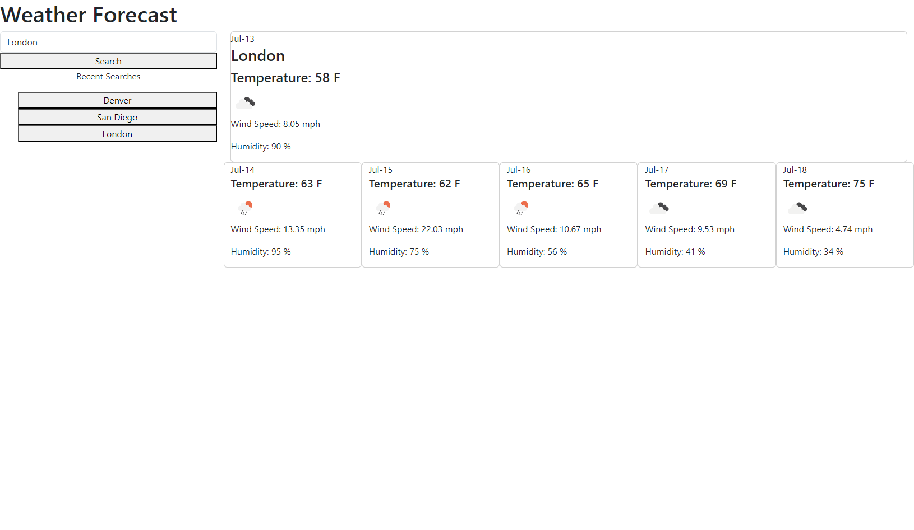

## Weather Forecast Application

## Table of Contents

- [Description](#description)
- [Usage](#usage)
- [Link](#link)

## Description

As a traveler, I want to see the current and future weather for multiple cities to that I can plan my trip accordingly. This allows me to input the name of a city and get the current and five-day forecast for that city. I can also access recent searches to reference if I need to check again. 

## Usage

To use the application the user must enter the name of their destination in the search input field and click the search button. The page will then display the current weather on the top right of the page and underneath will display the 5 day forecast for that city. The searched city will then populate in the recent searches list under the input field. The buttons under recent searches can be clicked again the updated data for that city will then display to the page as previously described.

Below is a screen shot of the deployed page:

## Link

https://kaylaasana.github.io/weather-forecast/
